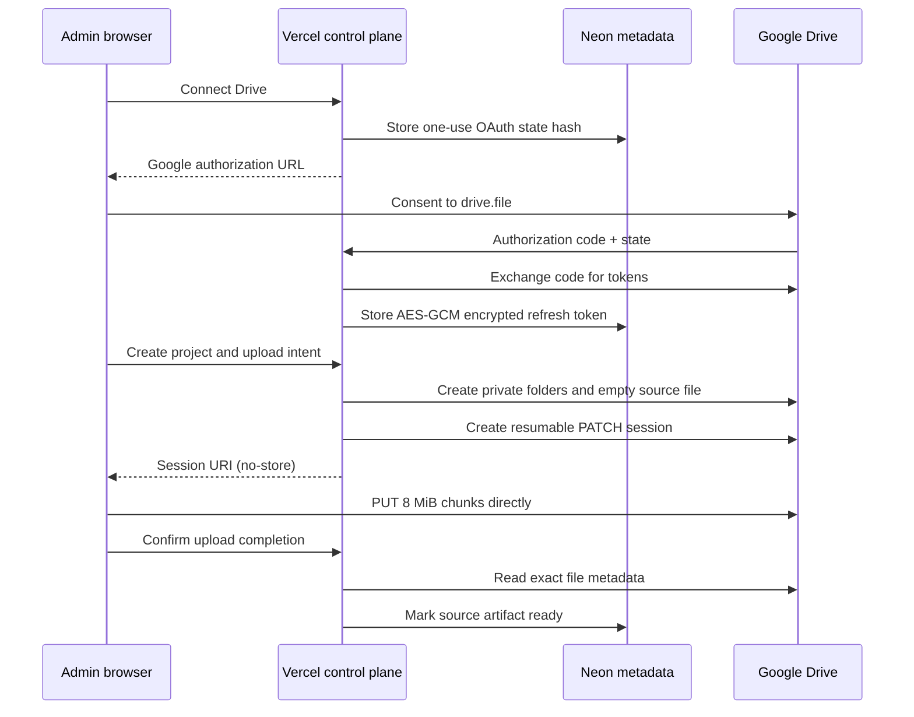

# CP-2 Google Drive Control-Plane Design

Date: 2026-07-19
Status: approved in conversation; written specification pending final user review
Base branch: `rebuild/v2`

## 1. Goal

Extend the Phase 8 metadata-only control plane with one administrator-owned
Google Drive connection, private project storage, resumable browser uploads,
and fail-closed Drive/Neon free-tier health. The live acceptance target is the
free stack: Vercel Hobby, Neon Free, and the administrator's existing Google
Drive storage.

Video bytes must travel directly between the browser and Google Drive. Vercel
must never receive, proxy, buffer, or persist video content.

## 2. Approved decisions

- Keep Neon for metadata. Do not migrate to Supabase.
- Request only `https://www.googleapis.com/auth/drive.file`.
- Use a server-side OAuth web application flow with offline access.
- Encrypt the Drive refresh token with AES-256-GCM before storing it in Neon.
- Create resumable upload sessions on the control plane and upload 8 MiB chunks
  directly from the browser to Google Drive.
- Store the resumable session URI only in browser IndexedDB. Treat it as a
  bearer capability and never store it in Neon, logs, audit events, URLs,
  analytics, or error reports.
- Keep source, checkpoint, and output files private in CP-2. Public output
  publication remains a later phase after render and manifest validation.
- Complete live acceptance on Vercel, Neon, and Google Drive Free before CP-2
  is considered complete.

## 3. Scope

### 3.1 In scope

- Google OAuth connect, callback, reconnect, and disconnect.
- One Drive account and one Drive workspace per deployment.
- App-owned `YTB-VPS/projects/<project_id>/` folder hierarchy.
- Project creation and one private source video per project.
- Resumable upload creation, pause, resume, reload recovery, cancellation, and
  completion verification.
- Metadata persistence for projects, artifacts, OAuth credential state, OAuth
  replay protection, and usage guards.
- Drive and Neon storage health with a 90-percent fail-closed threshold.
- Protected dashboard states and Vietnamese operator messages.
- Automated unit, integration, route, component, and browser-coordinator tests.
- Live upload of the existing Test 1 video from `resources/videos`.

### 3.2 Out of scope

- VPS enrollment, worker access tokens, leases, heartbeats, or job execution.
- Worker download/upload and checkpoint publication.
- Rectangle editing, blur preview, OCR, translation, TTS, or rendering.
- Public output links or Drive `anyoneWithLink` permissions.
- Google Picker, importing arbitrary pre-existing Drive files, shared drives,
  multi-account support, or multi-user accounts.
- Supabase Auth, Supabase Storage, Redis, paid queues, Vercel Blob, or any paid
  fallback.

## 4. Architecture and trust boundaries

### 4.1 Components

1. **Browser administrator UI**
   - Uses the existing signed admin session.
   - Stores only resumable session state in IndexedDB.
   - Sends file chunks directly to the Google upload session URI.
   - Never receives a Drive refresh token or OAuth client secret.

2. **Next.js control plane on Vercel**
   - Creates OAuth authorization requests and exchanges authorization codes.
   - Encrypts/decrypts the refresh token only when required.
   - Obtains short-lived access tokens in server memory.
   - Creates Drive folders, empty source placeholders, resumable update
     sessions, and verifies completed file metadata.
   - Handles only short JSON requests and metadata.

3. **Neon Postgres**
   - Stores bounded metadata, encrypted credential material, state hashes,
     quota snapshots, and bounded audit events.
   - Stores no video, audio, frame, full prompt, refresh-token plaintext,
     access token, OAuth code, resumable URI, or large provider response.

4. **Google Drive**
   - Stores all media and future checkpoint/output blobs.
   - Receives video chunks directly from the browser.
   - Exposes only app-created/app-opened files through `drive.file`.

The resumable session URI authorizes subsequent upload `PUT` requests; those
requests do not carry a Drive access token. Browser delivery depends on Google
accepting CORS preflight for `PUT`, `Content-Type`, and `Content-Range`, and on
the `Range` response header being readable after a `308`. The implementation
plan must begin with a tiny live-browser compatibility spike against the same
Google account and Vercel origin. A failed spike stops CP-2 for design review;
it must not silently move video bytes through Vercel or expose an access token.

### 4.2 Data flow



## 5. Free-tier and cost guarantees

- `NEON_STORAGE_LIMIT_BYTES` is required and initially configured as
  `536870912` (0.5 GiB). It is an operator declaration of the active plan, not
  a license to upgrade.
- `DRIVE_UPLOAD_MAX_BYTES` is required and initially configured as
  `10737418240` (10 GiB).
- `FREE_TIER_SOFT_PERCENT` is `90` in production; the parser accepts only
  integers in `50..90` so an operator can choose a stricter threshold but
  cannot weaken the 90-percent ceiling.
- `QUOTA_STALE_AFTER_SECONDS` is `900` in production and cannot be configured
  above 900 seconds.
- Drive provider usage comes from `about.get(fields=storageQuota,user)`.
- App-managed Drive usage is the sum of non-deleted artifact sizes in Neon.
- Neon usage comes from `pg_database_size(current_database())`.
- A new upload is refused if current usage is unknown/stale, current usage is
  at least 90 percent, or projected usage after the selected file would reach
  at least 90 percent.
- No code path changes a provider plan, enables billing, disables a spend cap,
  or selects a paid storage/queue fallback.
- Provider quota errors never trigger infinite retry.

## 6. Environment contract

The existing Phase 8 environment remains required. CP-2 adds:

- `GOOGLE_OAUTH_CLIENT_ID`: non-empty OAuth web client ID.
- `GOOGLE_OAUTH_CLIENT_SECRET`: non-empty OAuth web client secret.
- `DRIVE_TOKEN_KEY_V1`: canonical base64url encoding of exactly 32 random bytes.
- `NEON_STORAGE_LIMIT_BYTES=536870912`.
- `DRIVE_UPLOAD_MAX_BYTES=10737418240`.
- `FREE_TIER_SOFT_PERCENT=90`.
- `QUOTA_STALE_AFTER_SECONDS=900`.

The redirect URI is derived exactly as
`${APP_ORIGIN}/api/v1/drive/callback`; a separately configurable redirect URI
is forbidden because it can drift from the protected application origin.

Preview deployments must not receive production Google or Neon credentials.
Production secrets exist only in Vercel environment settings and local
`.env.local`; neither file nor value is committed.

## 7. OAuth connection design

### 7.1 Authorization request

`POST /api/v1/drive/connect` requires the current admin session and an exact
Origin match. It creates:

- a cryptographically random 32-byte nonce;
- a signed state token containing version `1`, nonce, issued-at, expiry, and a
  fixed return path `/`;
- a SHA-256 hash of the nonce in `oauth_states`.

The state expires after 10 minutes. The authorization URL requests exactly:

- `scope=https://www.googleapis.com/auth/drive.file`;
- `access_type=offline`;
- `prompt=consent`;
- `include_granted_scopes=false`;
- `response_type=code`;
- the exact derived HTTPS production redirect URI.

The route returns `{ authorizationUrl }` with `Cache-Control: no-store`.

### 7.2 Callback

`GET /api/v1/drive/callback`:

1. Requires a valid admin cookie.
2. Requires exactly one `state` and exactly one of `code` or `error`; accepts
   only Google's bounded optional callback fields, and rejects duplicate or
   unknown query keys.
3. Verifies the state signature and exact 10-minute lifetime.
4. Atomically consumes the nonce hash; replay fails even if the signature is
   otherwise valid.
5. Exchanges the code server-side with a five-second timeout.
6. Requires a refresh token and an exact granted scope set containing
   `drive.file` but no broad `drive`, `drive.readonly`, or metadata-wide scope.
7. Calls Drive `about.get` to obtain a bounded account hint and provider quota.
8. Encrypts the refresh token and upserts the singleton connection.
9. Creates or validates the `YTB-VPS` root folder.
10. Redirects to `/?drive=connected` without retaining code or state.

OAuth errors use stable non-secret codes and redirect to
`/?drive_error=<stable_code>`. Raw provider descriptions are never returned to
the browser.

CP-2 changes the admin cookie from `SameSite=Strict` to `SameSite=Lax` so it is
sent on Google's top-level HTTPS redirect back to the callback. The cookie
remains `HttpOnly`, `Secure` in production, path `/`, and 12-hour bounded. The
callback still requires the signed one-use state, while every state-changing
POST continues to require an exact Origin match; no mutation is authorized by
the Lax cookie alone.

### 7.3 Disconnect and reconnect

`POST /api/v1/drive/disconnect` attempts Google token revocation first. If
revocation succeeds, encrypted token material is cleared and status becomes
`DISCONNECTED`. App-created files are not deleted.

If revocation is temporarily unavailable, status becomes `REVOKE_PENDING` and
normal Drive operations are disabled. The encrypted token is retained only so
another explicit disconnect request can retry revocation. Reconnect replaces
the credential and revalidates the account/workspace association.

The stable hash of Google's account permission ID binds an existing workspace
to its original Drive account. If any project/artifact exists, reconnecting a
different account fails with `DRIVE_ACCOUNT_MISMATCH` and does not overwrite
the old credential or folder IDs. If no project/artifact exists, an explicit
reconnect may replace the account and establish a new root folder.

`invalid_grant`, revoked credentials, or decryption failure set status to
`REAUTH_REQUIRED`, clear unusable encrypted credential material, and fail
closed. `REAUTH_REQUIRED` and `DISCONNECTED` rows require all encrypted fields
to be null; only `CONNECTED` and `REVOKE_PENDING` may retain them.

## 8. Credential encryption

- Algorithm: AES-256-GCM.
- Key: `DRIVE_TOKEN_KEY_V1`, decoded to exactly 32 bytes.
- Nonce: 12 random bytes per encryption.
- Authentication tag: 16 bytes.
- Additional authenticated data:
  `ytb-vps:drive-refresh-token:v1:<credential_id>:<scope>`.
- Stored values: ciphertext, nonce, tag, key version, scope, and timestamps.
- Maximum refresh-token plaintext accepted: 4096 UTF-8 bytes.
- Decryption authenticates before returning plaintext and returns a generic
  credential-unavailable result on any failure.
- Key version `1` is the only writable version in CP-2. The schema retains a
  version field so a later reviewed migration can rotate keys without changing
  the row format.

No token plaintext is interpolated into exceptions, audit payloads, console
output, snapshots, or test fixtures.

## 9. Drive hierarchy and file ownership

```text
YTB-VPS/
  projects/<project_id>/
    input/source.<normalized_extension>
    checkpoints/
    outputs/
```

- All folders/files are created by the app under `drive.file` and remain
  private.
- Project IDs are application-generated UUID strings and folder names use the
  ID, not the user-provided project name.
- Accepted source extensions are `.mp4`, `.mov`, `.mkv`, and `.webm` with MIME
  types `video/mp4`, `video/quicktime`, `video/x-matroska`, and `video/webm`.
- User filenames are retained only as bounded display metadata. The remote
  source filename is normalized to `source.<extension>`.
- Before any update, completion, cancellation, or future deletion, the control
  plane re-reads the file and verifies its file ID, project association,
  expected parent folder, and app-owned artifact row.
- Disconnect never removes Drive files.

## 10. Database migration v2

Migration v2 is explicit, transactional, advisory-locked, and idempotent. It
adds only CP-2-owned tables and indexes.

### 10.1 `projects`

- `id text primary key` — UUID generated by the application.
- `status text not null` — `PROVISIONING`, `READY`, `FAILED`.
- `name text not null` — trimmed length `1..160`.
- `source_status text not null` — `NO_SOURCE`, `UPLOAD_PENDING`,
  `SOURCE_READY`, `UPLOAD_FAILED`.
- `creation_idempotency_key_hash text not null unique` — exact 64 lowercase
  hex; the raw header is never persisted.
- `creation_request_hash text not null` — exact 64 lowercase hex.
- `drive_project_folder_id text` — nullable while provisioning; otherwise
  length `10..256`.
- `drive_input_folder_id text` — nullable while provisioning; otherwise length
  `10..256`.
- `created_at`, `updated_at timestamptz not null`.
- A ready row requires both folder IDs; a provisioning/failed row cannot be
  used for upload.

Project and child folders receive private Drive `appProperties` containing the
project ID and a fixed role. A retry with the same idempotency key and request
hash resumes the same project row and ensures/reuses those exact folders. The
same key with a different request hash returns `IDEMPOTENCY_CONFLICT`. This
closes the crash window between Drive side effects and the final Neon update.

### 10.2 `artifacts`

- `id text primary key` — UUID.
- `project_id text not null references projects(id)`.
- `kind text not null` — `SOURCE`, `CHECKPOINT`, `OUTPUT`.
- `status text not null` — `PENDING`, `UPLOADING`, `READY`, `INVALID`,
  `DELETED`.
- `drive_file_id`, `drive_parent_id text not null` — bounded provider IDs.
- `display_name text not null` — length `1..255`.
- `mime_type text not null` — length `1..127`.
- `expected_size_bytes bigint not null` — `1..DRIVE_UPLOAD_MAX_BYTES` enforced
  in the application; database upper bound `1099511627776`.
- `actual_size_bytes bigint` — non-negative and nullable until verified.
- `checksum_sha256 text` — nullable until the worker computes it; exact 64
  lowercase hex when present.
- `created_at`, `updated_at`, `verified_at timestamptz`.
- A partial unique index permits at most one non-deleted `SOURCE` per project.

### 10.3 `oauth_credentials`

- Singleton `id smallint primary key check (id = 1)`.
- `status` — `CONNECTED`, `REAUTH_REQUIRED`, `REVOKE_PENDING`, `DISCONNECTED`.
- `ciphertext bytea`, `nonce bytea`, `auth_tag bytea`, `key_version smallint`.
- `scope text`, `account_hint text`, `account_permission_id_hash text`.
- `root_folder_id text`.
- `created_at`, `updated_at`, `last_verified_at timestamptz`.
- Connected/revoke-pending rows require complete canonical encrypted fields;
  reauth-required/disconnected rows require those fields to be null.

### 10.4 `oauth_states`

- `nonce_hash text primary key` — exact 64 lowercase hex.
- `expires_at timestamptz not null`.
- `consumed_at timestamptz`.
- `created_at timestamptz not null`.
- Rows are bounded by deleting expired/consumed entries during connect and
  callback requests.

### 10.5 `usage_guards`

- `provider text primary key` — `DRIVE` or `NEON`.
- `used_bytes`, `limit_bytes`, `app_managed_bytes bigint not null`.
- `mode text not null` — `READ_WRITE` or `READ_ONLY`.
- `reason_codes jsonb not null` — array of stable strings, maximum 2 KiB.
- `observed_at`, `updated_at timestamptz not null`.

Audit payloads remain bounded by the existing 16 KiB database constraint and
contain only stable event fields.

## 11. Domain state and repository boundaries

New pure-domain types:

- `DriveConnectionStatus`.
- `ProjectSourceStatus`.
- `ArtifactKind` and `ArtifactStatus`.
- `UsageSnapshot`, `ProjectedUpload`, and `FreeTierDecision`.
- `UploadIntent` and `VerifiedDriveFile`.

New ports:

- `DriveOAuthPort`: build URL, exchange code, refresh access, revoke token.
- `DriveFilesPort`: inspect account, ensure folders, create/reuse an empty
  source file, create resumable update session, inspect file, cancel a pending
  source file.
- `CredentialCipher`: encrypt/decrypt bounded refresh tokens.
- `DriveControlPlaneRepository`: OAuth state, singleton credential, projects,
  artifacts, usage snapshots, and audit operations.

Domain modules import no Next.js, Google SDK, Neon driver, filesystem, browser,
or Node crypto modules. Adapters depend inward on these interfaces.

## 12. HTTP API contracts

Every endpoint is under `/api/v1`, uses stable JSON errors, has a strict body
schema and byte limit, and sends `Cache-Control: no-store` for sensitive or
mutable results.

### 12.1 Drive

- `POST /drive/connect`
  - body: exactly `{}`; maximum 128 bytes.
  - returns `{ authorizationUrl }`.
- `GET /drive/callback`
  - query: exactly one `state` and exactly one `code` or `error`; only bounded
    Google callback fields are accepted and duplicate keys are rejected.
  - returns a same-origin redirect only.
- `POST /drive/disconnect`
  - body: exactly `{}`; maximum 128 bytes.
  - returns the sanitized connection status.

### 12.2 Projects and upload

- `POST /projects`
  - body: `{ name: string }`, trimmed `1..160`; maximum 1 KiB.
  - requires `Idempotency-Key` of 16..128 printable ASCII characters.
  - creates/reuses the exact Drive project folders and returns project metadata;
    retrying the same key/body resumes provisioning, while a changed body is a
    conflict.
- `POST /projects/:id/upload-session`
  - body: `{ fileName, mimeType, sizeBytes, lastModified }`; maximum 2 KiB.
  - validates file type, configured maximum, current/projected free-tier state,
    and one-source rule.
  - creates or reuses one empty source file and returns
    `{ artifactId, sessionUri, chunkBytes: 8388608, expiresAt }`.
  - response adds `Referrer-Policy: no-referrer` and `Cache-Control: no-store`.
- `POST /projects/:id/upload-complete`
  - body: `{ artifactId }`; maximum 1 KiB.
  - re-reads Drive metadata and verifies exact file ID, parent, size, MIME type,
    and ownership before marking `READY`/`SOURCE_READY`.
- `POST /projects/:id/upload-cancel`
  - body: `{ artifactId }`; maximum 1 KiB.
  - deletes only an app-owned, still-pending source with no job reference after
    remote evidence is revalidated.

`sessionUri` is returned only by `upload-session`; it is excluded from all
repository and audit interfaces.

### 12.3 Health

- `GET /health/free-tier`
  - requires admin authentication because provider/account usage is private.
  - returns sanitized Drive/Neon usage, connection state, snapshot age, mode,
    and stable reason codes.
  - returns read-only state rather than a false healthy result when a provider
    cannot be checked.

All mutation endpoints require a valid admin session and exact Origin. OAuth
callback is protected by both the admin cookie and one-use state.

## 13. Resumable browser uploader

### 13.1 IndexedDB record

Database: `ytb-vps-upload-v1`.
Key: `<project_id>:<artifact_id>`.

Record fields:

- `projectId`, `artifactId`.
- `sessionUri`.
- `fileIdentity`: display name, byte size, MIME type, and last-modified epoch.
- `nextOffset`.
- `chunkBytes=8388608`.
- `expiresAt` no later than seven days after session creation.

Records are deleted on verified completion, explicit cancellation, file
identity mismatch, provider-declared session expiry, or local expiry.

### 13.2 Upload algorithm

1. Compare the selected browser `File` to the stored identity.
2. If recovering, query the session with an empty `PUT` and
   `Content-Range: */<total>`.
3. Interpret `308 Resume Incomplete` and its `Range` as the only authoritative
   committed offset.
4. Upload 8 MiB `Blob` slices with exact `Content-Range`; the browser supplies
   the matching `Content-Length`, which application JavaScript must not try to
   set because it is a forbidden request header. The final chunk may be
   smaller.
5. Persist the next offset only after Drive acknowledges it.
6. On network error or `5xx`, query status and retry with truncated exponential
   backoff plus jitter, maximum five attempts per chunk.
7. On `429`, use the same bounded backoff and surface a paused state after
   exhaustion.
8. On any other `4xx`, including a rate-limit `403` or expired-session `404`,
   discard the old local URI and request a new update session for the same
   pending Drive file after bounded backoff. Count session replacements toward
   the same five-attempt ceiling so quota errors cannot loop forever.
9. On local expiry, follow the same bounded new-session path.
10. On success, call `upload-complete`; do not trust the browser's success
    alone.

Pause stops before the next chunk and retains IndexedDB state. Cancel uses the
protected control-plane endpoint and clears IndexedDB only after a successful
or already-cancelled response.

## 14. Dashboard behavior

### 14.1 Drive card

- `Chưa kết nối`: primary `Kết nối Google Drive` action.
- `Đã kết nối`: bounded account hint, app-managed usage, provider usage,
  snapshot timestamp, and `Ngắt kết nối` action.
- `Cần kết nối lại`: disables new projects/uploads and offers reconnect.
- `Chỉ đọc do quota`: shows stable Vietnamese reason and remediation without a
  paid-upgrade link.

### 14.2 New project/upload view

- Creates a project name before selecting a source.
- Shows accepted formats and the 10 GiB configured maximum.
- Displays bytes uploaded, percentage, current throughput, and next action.
- Offers pause, resume, cancel, and reload recovery.
- Prevents navigation-loss surprises with a browser warning only while a chunk
  is active.
- Shows `Chưa gắn GPU VPS` after source readiness; upload is still a valid CP-2
  completion.

The UI never renders a session URI, file ID, access token, provider error body,
or encrypted credential.

## 15. Error policy

Stable public codes include:

- `DRIVE_NOT_CONNECTED`, `DRIVE_REAUTH_REQUIRED`.
- `DRIVE_ACCOUNT_MISMATCH`, `IDEMPOTENCY_CONFLICT`.
- `OAUTH_STATE_INVALID`, `OAUTH_STATE_EXPIRED`, `OAUTH_STATE_REPLAYED`,
  `OAUTH_SCOPE_REJECTED`, `OAUTH_REFRESH_TOKEN_MISSING`.
- `DRIVE_QUOTA_STALE`, `DRIVE_STORAGE_HIGH`, `NEON_STORAGE_HIGH`.
- `UPLOAD_TYPE_REJECTED`, `UPLOAD_TOO_LARGE`, `UPLOAD_SESSION_EXPIRED`,
  `UPLOAD_REMOTE_MISMATCH`, `UPLOAD_RETRY_EXHAUSTED`.
- `DRIVE_RATE_LIMITED`, `DRIVE_TEMPORARILY_UNAVAILABLE`.

Rules:

- `401`/`invalid_grant`: mark reauthentication required.
- Storage quota exhaustion: read-only without retry.
- `429`, retryable `403`, and `5xx`: maximum five attempts with jitter.
- OAuth/token requests: five-second timeout and at most two total attempts.
- Metadata reads/writes: five-second timeout and at most three total attempts.
- Unknown, stale, malformed, or contradictory evidence always fails closed.

## 16. Logging and audit

Allowed audit events:

- `DRIVE_CONNECT_STARTED`, `DRIVE_CONNECTED`, `DRIVE_REAUTH_REQUIRED`,
  `DRIVE_DISCONNECTED`.
- `PROJECT_CREATED`, `UPLOAD_SESSION_CREATED`, `UPLOAD_COMPLETED`,
  `UPLOAD_CANCELLED`, `UPLOAD_FAILED`.
- `FREE_TIER_MODE_CHANGED`.

Allowed payload fields are stable IDs, actor class, byte counts, MIME type,
status, reason code, key version, and timestamps. The following are scrubbed
recursively from logs and audit payloads: Authorization/cookie headers,
refresh/access tokens, OAuth code/state, resumable URI/upload ID, OAuth client
secret, encryption key, full account email, and raw provider bodies.

## 17. Testing strategy

### 17.1 Unit tests

- Strict environment parsing and forbidden broad scopes.
- AES-GCM round trip, AAD binding, canonical key parsing, tamper detection, and
  4096-byte token limit.
- Signed OAuth state lifetime and runtime claim validation.
- Free-tier current/projected threshold boundaries at exactly 90 percent.
- Upload file identity, chunk boundaries, retry ceilings, offset recovery, and
  session expiry.

### 17.2 Database tests

- Migration v2 applies twice under PGlite.
- All enum/check/size constraints reject invalid rows.
- OAuth nonce consumption is atomic and replay-safe.
- Project idempotency and one-source uniqueness hold under concurrency.
- Invalid persisted states fail before entering domain types.

### 17.3 Adapter and route tests

- Fake OAuth/Drive servers verify exact URL, scope, timeout, and secret scrub.
- Connect/callback/disconnect cover denial, replay, missing refresh token,
  broad scope, revocation failure, and reconnect.
- Project/upload routes cover auth, Origin, strict body limits, idempotency,
  quota projection, remote mismatch, and no session-URI persistence.
- Real repository SQL is exercised through PGlite where semantics matter.

### 17.4 Component and browser-coordinator tests

- All Drive card states and disabled actions.
- Pause/resume/reload with fake IndexedDB and fake Drive fetch responses.
- `308`, partial Range, network interruption, `429`, `5xx`, expiry, cancel, and
  completion verification.
- A fail-fast live-browser spike proves preflight, header exposure, and a
  two-chunk resumable upload before the rest of CP-2 is implemented.
- Tests assert real visible behavior rather than mock component presence.

### 17.5 Regression gate

- Existing Python 3.10 compile and all v2 tests remain green.
- Existing Phase 8 web tests remain green.
- Web tests, typecheck, lint, production build, migration idempotency, secret
  scan, tracked-path scan, and `npm audit --audit-level=low` all pass.
- GitHub Actions retains independent Python 3.10 and Node 22 jobs.

## 18. Live free-stack acceptance

1. Create one Neon Free project with scale-to-zero and apply migrations.
2. Create one Google Cloud project, enable Drive API, configure an OAuth web
   client, and request only `drive.file`.
3. Set the exact Vercel production callback URI.
4. Move the OAuth consent screen to Production before long-lived acceptance;
   Testing-mode refresh tokens are not accepted as the final gate.
5. Configure Vercel production secrets and deploy from `rebuild/v2`.
6. Log in with the existing admin key and connect the administrator's Drive.
7. Confirm `YTB-VPS` and project folders are private.
8. Upload the existing Test 1 video directly from `resources/videos`.
9. Reload during upload, resume from Drive's acknowledged offset, and complete.
10. Verify exact Drive file ID, parent, MIME type, and size in Neon metadata.
11. Verify no video request appears in Vercel function traffic and no sensitive
    value appears in Vercel logs, Neon rows, audit payloads, or Git history.
12. Disconnect/reconnect and verify files remain private and intact.
13. Record provider dashboard screenshots/metadata-only evidence and all test
    counts in `docs/rebuild/AUDIT-LOG.md`; do not commit credentials or media.

## 19. Deployment and rollback

- Schema migration is additive; Phase 8 jobs/auth tables remain unchanged.
- Deploy migration before the CP-2 application.
- Until a credential is connected and fresh quota evidence exists, CP-2 stays
  read-only while the Phase 8 login/dashboard remains available.
- Rollback deploys the previous application commit. Additive CP-2 tables remain
  unused; they are not dropped automatically.
- Disconnect or rollback never deletes remote Drive content.
- Any destructive cleanup requires a later reviewed proof-based cleanup design.

## 20. Completion gate

CP-2 is complete only when:

- every automated and regression gate passes;
- the final whole-branch security review has no Critical or Important finding;
- GitHub Node 22 and Python 3.10 jobs pass;
- live Vercel/Neon/Drive acceptance passes with Test 1;
- `npm audit --audit-level=low` reports zero vulnerabilities;
- Google OAuth is Production with only `drive.file`;
- no secret, resumable URI, media file, `.env`, `.superpowers`, or `resources`
  path is tracked;
- the result remains usable without purchasing a service or enabling billing.

## 21. Primary references

- Google Drive API upload protocol:
  <https://developers.google.com/workspace/drive/api/guides/manage-uploads>
- Google Drive API scopes:
  <https://developers.google.com/workspace/drive/api/guides/api-specific-auth>
- Google OAuth web-server flow:
  <https://developers.google.com/identity/protocols/oauth2/web-server>
- Google Drive API limits and retry guidance:
  <https://developers.google.com/workspace/drive/api/guides/limits>
- Neon Free plan:
  <https://neon.com/pricing>
- Neon scale to zero:
  <https://neon.com/docs/introduction/scale-to-zero>
