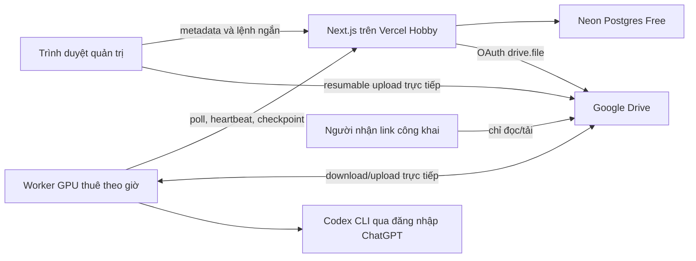

# Thiết kế Control Plane Vercel + Worker GPU thuê theo giờ

Status: approved in conversation; awaiting review of this written specification

Date: 2026-07-19

Branch: `rebuild/v2`

Extends: `docs/superpowers/specs/2026-07-16-v2-rebuild-design.md`

## 1. Mục tiêu

Xây dựng một website cá nhân luôn sẵn sàng trên Vercel để chuẩn bị và quản lý
job video. Khi cần render, người vận hành thuê một máy Community GPU giá rẻ,
chạy một lệnh gắn worker vào website, đăng nhập Codex bằng tài khoản ChatGPT và
để worker xử lý. Khi job hoàn tất, người vận hành tải video từ liên kết công
khai rồi có thể xóa dữ liệu và hủy VPS.

Thiết kế phải đạt các kết quả sau:

- website vẫn hoạt động khi không có VPS;
- video lớn không đi qua Vercel Functions;
- Vercel chỉ điều phối, không OCR, dịch, TTS hoặc render;
- worker không cần Docker và phù hợp RTX 3060 12 GB, RAM 16 GB, Ubuntu 22.04,
  CUDA 12.4;
- job có thể tiếp tục trên VPS mới sau khi VPS cũ mất;
- vùng blur do người vận hành vẽ là hình chữ nhật tĩnh, áp dụng toàn video;
- dịch bằng Codex CLI với đăng nhập ChatGPT, không dùng OpenAI API key;
- không có cơ chế tự nâng cấp sang dịch vụ trả phí;
- ngoài tiền thuê GPU VPS do người vận hành chủ động trả, kiến trúc ban đầu dùng
  các gói miễn phí.

## 2. Quyết định sản phẩm đã chốt

- Giao diện là trình biên tập một màn hình: video bên trái, danh sách vùng bên
  phải.
- Hai loại vùng là `source_subtitle` và `logo`.
- Mọi vùng áp dụng từ đầu đến cuối video. Không có keyframe, tracking hoặc vùng
  blur di chuyển trong phiên bản này.
- `source_subtitle` vừa giới hạn phạm vi OCR vừa được blur; `logo` chỉ được
  blur.
- Website không có hệ thống tài khoản nhiều người dùng. Một admin key bảo vệ
  toàn bộ thao tác quản trị.
- File đầu vào luôn riêng tư. File đầu ra được đặt quyền
  `anyoneWithLink: reader` để ai có link cũng tải được, nhưng không có quyền sửa
  hoặc xóa.
- Google Drive chứa video đầu vào, checkpoint và đầu ra. Neon chỉ chứa metadata,
  trạng thái và audit nhỏ.
- Worker chủ động gọi HTTPS ra ngoài; Vercel không SSH vào VPS và VPS không cần
  mở cổng dịch vụ cho website.
- Worker chạy môi trường native đã pin, không chạy Docker.
- Dịch giữ cơ chế Codex CLI của v1 nhưng sửa các điểm chất lượng đã audit.
- TTS ban đầu dùng `edge-tts` với giọng Việt; không dùng GPU, không có fallback
  trả phí và không âm thầm đổi giọng.
- Render ưu tiên NVENC sau khi smoke test; fallback CPU chỉ được dùng khi cấu
  hình dự án cho phép rõ ràng và phải hiển thị cảnh báo.
- Không tự động xóa file sau render. Xóa chỉ xảy ra khi người vận hành bấm xác
  nhận và các điều kiện an toàn đã đạt.

## 3. Kiến trúc tổng thể



### 3.1 Control plane

Ứng dụng Next.js trên Vercel chịu trách nhiệm:

- xác thực admin;
- tạo dự án, lưu cấu hình và vùng blur;
- khởi tạo upload trực tiếp lên Drive;
- quản lý hàng đợi, lease và heartbeat;
- cấp quyền ngắn hạn cho worker;
- nhận tiến độ, log đã lọc và manifest checkpoint;
- hiển thị preview, trạng thái và liên kết kết quả;
- phát hành lệnh cài worker có enrollment token dùng một lần;
- kiểm tra hạn mức miễn phí và từ chối thao tác khi có nguy cơ vượt ngưỡng.

Control plane không nhận body video, không proxy download video, không giữ tiến
trình chờ dài và không thực hiện công việc nặng trong Vercel Function.

### 3.2 Data plane

Worker Python trên VPS chịu trách nhiệm:

- tải source/checkpoint từ Drive;
- kiểm tra media và fingerprint cấu hình;
- OCR trong đúng các vùng `source_subtitle`;
- tạo cue, dịch qua Codex CLI, tổng hợp TTS;
- render, kiểm tra đầu ra và upload lại Drive;
- ghi checkpoint sau mỗi giai đoạn đắt tiền;
- gia hạn lease và báo tiến độ;
- dừng an toàn khi mất lease, hết quota hoặc thiếu tài nguyên.

Worker tái sử dụng domain/application/ports của v2. Website là lớp điều phối mới,
không tạo một pipeline media thứ hai.

## 4. Ranh giới miễn phí và chi phí

### 4.1 Thành phần miễn phí

- Vercel Hobby cho website cá nhân, phi thương mại.
- Neon Free cho metadata; bật scale-to-zero và giới hạn tài nguyên ở mức Free.
- Google Drive từ dung lượng tài khoản hiện có.
- Codex CLI đăng nhập bằng tài khoản ChatGPT hiện có; không cấu hình API key.
- `edge-tts` cho giọng đọc và preview, không có backend trả phí dự phòng.
- tên miền mặc định `*.vercel.app`; custom domain không thuộc phạm vi.

Vercel Hobby chỉ hợp lệ cho mục đích cá nhân/phi thương mại và sẽ dừng dịch vụ
khi hết hạn mức thay vì tự tính thêm tiền. Thiết kế không dựa vào Function chạy
quá 60 giây hoặc cron thường xuyên hơn một lần mỗi ngày.

### 4.2 Cost guard bắt buộc

- Không lưu billing credential cho OpenAI hoặc dịch vụ TTS.
- Worker từ chối nhận stage dịch nếu phát hiện xác thực Codex bằng API key.
- Không có code path nâng Vercel, Neon hoặc provider lên paid tier.
- Không retry vô hạn. Mọi provider có số lần thử và backoff hữu hạn.
- Khi Codex hết quota, job chuyển sang `PAUSED_QUOTA`, giữ checkpoint và chờ
  người vận hành tiếp tục.
- Khi Drive, Neon hoặc Vercel chạm ngưỡng cấu hình, control plane chuyển sang
  read-only/fail-closed và hiển thị hướng xử lý.
- Dashboard hiển thị dung lượng Drive do ứng dụng quản lý, kích thước job và
  thời gian worker; không gọi đây là hóa đơn VPS vì giá thuê nằm ngoài hệ thống.

### 4.3 Giới hạn vận hành

Kiến trúc nhắm một người vận hành và một worker GPU hoạt động tại một thời điểm.
Không cam kết SLA. Nếu dự án chuyển sang thương mại, đông người dùng hoặc lưu
trữ lớn, phải phê duyệt một thiết kế và ngân sách mới trước khi triển khai.

## 5. Lưu trữ Google Drive

### 5.1 Quyền OAuth

Ứng dụng chỉ xin scope `https://www.googleapis.com/auth/drive.file`. Scope này
giới hạn ứng dụng vào các file do ứng dụng tạo hoặc được người dùng chọn/chia sẻ
cho ứng dụng; không xin scope rộng `drive` hoặc `drive.readonly`.

Google OAuth app phải được chuyển sang trạng thái Production trước khi dùng lâu
dài. Nếu để External/Testing, refresh token Drive có thể hết hạn sau bảy ngày.
Việc chuyển trạng thái không đồng nghĩa bật thanh toán, nhưng consent screen và
redirect URI HTTPS phải được cấu hình đúng.

### 5.2 Cấu trúc file

```text
YTB-VPS/
  projects/<project_id>/
    input/source.<ext>
    checkpoints/<fingerprint>/<stage>/manifest.json
    checkpoints/<fingerprint>/<stage>/<artifact>
    outputs/<render_id>/Part_01_of_N.mp4
    outputs/<render_id>/Part_02_of_N.mp4
    outputs/<render_id>/validation.json
```

- Tên hiển thị gốc chỉ là metadata; path dùng ID ngẫu nhiên, không dùng trực tiếp
  filename từ người dùng.
- Input và checkpoint giữ private.
- Chỉ các file `outputs/<render_id>/Part_*_of_N.mp4` được đặt
  `anyoneWithLink: reader` sau khi toàn bộ Part và validation manifest thành
  công.
- Manifest lưu checksum SHA-256, kích thước, content type, stage fingerprint và
  source fingerprint.

### 5.3 Luồng upload/download

1. Control plane tạo file Drive private và một resumable upload session.
2. Trình duyệt tải video thẳng vào session URL; byte video không qua Vercel.
3. Sau upload, control plane đọc metadata/checksum khả dụng và worker tự tính
   SHA-256 khi tải lần đầu.
4. Worker nhận access token Drive ngắn hạn từ control plane, chỉ giữ trong bộ
   nhớ và tải file trực tiếp.
5. Worker upload checkpoint/output bằng resumable upload.
6. Control plane chỉ công khai output sau khi checksum và validation manifest
   khớp.

Refresh token Drive được mã hóa AES-256-GCM trước khi lưu Neon. Khóa mã hóa chỉ
nằm trong Vercel environment. Access token không được ghi DB, log hoặc ổ đĩa
worker.

### 5.4 Xóa dữ liệu

Nút `Xóa dữ liệu dự án` yêu cầu nhập lại admin key và hiển thị chính xác các file
sẽ xóa. Control plane chỉ cho xóa khi:

- không còn lease worker hợp lệ;
- output hoàn tất đã được kiểm tra hoặc người vận hành chọn hủy dự án chưa hoàn
  tất một cách rõ ràng;
- mọi Drive file ID thuộc đúng project đang xóa;
- thao tác dùng file ID, không ghép path tùy ý;
- audit record được ghi trước và sau thao tác.

Không có auto-delete trong bản đầu. Daily cron chỉ dùng để đánh dấu worker/lease
hết hạn và dọn token đã vô hiệu; cron không xóa video.

## 6. Xác thực và bảo mật

### 6.1 Admin

- Một admin key ngẫu nhiên tối thiểu 128 bit.
- Vercel environment chỉ lưu bản hash scrypt có salt, không lưu plaintext.
- Login thành công tạo cookie HttpOnly, Secure, SameSite=Strict, có chữ ký, hết
  hạn sau 12 giờ.
- Các mutation kiểm tra Origin/CSRF và rate limit theo session/IP.
- Không có đăng ký, khôi phục mật khẩu hoặc tài khoản khách.
- Output public route không cho phép liệt kê dự án; chỉ ID/token đủ entropy mới
  truy cập được.

### 6.2 Worker enrollment

1. Admin bấm `Gắn VPS` để tạo enrollment token 256 bit, hash trong DB, hết hạn
   sau 10 phút và chỉ dùng một lần.
2. Website hiển thị một lệnh cài đặt chứa URL và token này.
3. Script tải bundle theo release version, xác minh SHA-256 rồi cài vào thư mục
   riêng.
4. Token được đổi lấy `worker_id` và session secret; enrollment token bị thu hồi
   ngay trong cùng transaction.
5. Session secret lưu file mode `0600`, thư mục mode `0700`, và được gửi qua
   HTTPS Bearer header.
6. Worker session hết hạn tối đa sau 24 giờ hoặc khi admin bấm `Ngắt VPS`.

Không đưa mật khẩu root, SSH private key, Codex credential hoặc Google refresh
token vào website.

### 6.3 Codex credential

- Sau bootstrap, worker chạy `codex login --device-auth` và hiển thị URL/mã để
  người vận hành xác nhận trong trình duyệt.
- `codex login status` phải xác nhận đăng nhập ChatGPT trước khi worker nhận job
  có stage dịch.
- `OPENAI_API_KEY` và các biến API key tương đương phải vắng mặt; nếu có, doctor
  thất bại và worker không chạy dịch.
- `CODEX_HOME` riêng nằm dưới secret root, mode `0700`; `auth.json` nếu được dùng
  phải mode `0600`.
- Credential Codex không upload, không backup và không xuất hiện trong log.
- `Ngắt VPS` gọi logout và xóa `CODEX_HOME` sau khi worker dừng an toàn. Nếu VPS
  bị xóa đột ngột, sự cô lập cuối cùng phụ thuộc nhà cung cấp VPS; vì vậy VPS chỉ
  được xem là máy thuê tin cậy tạm thời.

## 7. Mô hình dữ liệu control plane

Neon chứa các bảng logic sau; migration phải có version và transaction:

- `projects`: ID, tên, source metadata, source Drive ID/hash, cấu hình hiện tại,
  status, timestamps.
- `project_revisions`: immutable JSON cấu hình/vùng, revision number,
  fingerprint, người tạo là `admin`.
- `regions`: revision ID, type, normalized x/y/width/height, source width/height,
  label và order.
- `jobs`: project revision, state, priority cố định, active stage, progress,
  error code, requested/cancelled timestamps.
- `job_attempts`: attempt, worker, lease, stage, start/end, kết quả và lỗi đã lọc.
- `workers`: ID, session hash, capabilities, doctor report, heartbeat, status,
  revoked timestamp.
- `leases`: job ID duy nhất, worker ID, fencing token tăng đơn điệu, expiry.
- `artifacts`: owner stage, Drive file ID, size, checksum, fingerprint,
  validation status, public token nếu là output.
- `checkpoints`: job, stage, manifest artifact, dependency fingerprint và thời
  điểm xác minh.
- `oauth_credentials`: encrypted Drive refresh token, nonce, key version, scope,
  account hint và trạng thái.
- `enrollment_tokens`: hash, expiry, consumed/revoked timestamp.
- `audit_events`: loại sự kiện, target ID, actor class, timestamp và payload đã
  loại secret.
- `usage_guards`: quota snapshot gần nhất và cờ fail-closed.

Video, audio, frame, OCR blob lớn và log đầy đủ không được lưu trong Neon. JSON
metadata phải có giới hạn kích thước. Event/progress lặp lại được gộp để DB không
tăng vô hạn.

## 8. State machine và lease

### 8.1 Trạng thái job

```text
DRAFT -> READY -> QUEUED -> CLAIMED -> DOWNLOADING
      -> OCR -> TRANSLATE -> REVIEW_READY -> TTS -> RENDER
      -> UPLOADING -> COMPLETED
```

Trạng thái phụ:

- `PAUSED_REVIEW`: chờ người vận hành sửa/duyệt bản dịch;
- `PAUSED_QUOTA`: Codex hoặc free tier tạm hết hạn mức;
- `PAUSED_NO_WORKER`: không có worker nhưng checkpoint còn nguyên;
- `FAILED_RETRYABLE`: lỗi có thể tiếp tục với attempt mới;
- `FAILED_FINAL`: lỗi vi phạm dữ liệu/cấu hình không được tự retry;
- `CANCEL_REQUESTED` và `CANCELLED`;
- `DELETING` và `DELETED`.

`REVIEW_READY` tự chuyển sang `PAUSED_REVIEW` nếu dự án bật duyệt thủ công; nếu
tắt, nó chuyển thẳng sang TTS. Mặc định bật duyệt thủ công để người vận hành có
cơ hội sửa bản dịch trước khi tốn thời gian TTS/render.

### 8.2 Claim và fencing

- Worker poll tối đa mỗi 10 giây khi online; backoff đến 60 giây khi không có
  việc.
- Lease ban đầu 90 giây, heartbeat mỗi 30 giây.
- Mỗi lần claim/reclaim sinh `fencing_token` lớn hơn lần trước.
- Mọi progress, checkpoint và complete mutation phải mang fencing token hiện
  tại. Worker cũ không thể ghi sau khi mất lease.
- Khi heartbeat mất quá lease, job về `PAUSED_NO_WORKER` hoặc
  `FAILED_RETRYABLE` tùy stage; artifact đã commit vẫn giữ nguyên.
- Chỉ một worker được giữ một job; phiên bản đầu không chạy hai job media nặng
  đồng thời.

API trả nhanh; worker tự poll. Không phụ thuộc WebSocket hoặc long polling để
phù hợp Vercel Hobby.

## 9. Giao diện và luồng sử dụng

### 9.1 Dashboard

Dashboard hiển thị:

- kết nối Drive và free-tier health;
- trạng thái worker: offline, setting up, doctor failed, ready, busy;
- danh sách project/job, stage, phần trăm, lỗi và thời gian cập nhật;
- nút `Dự án mới`, `Gắn VPS`, `Ngắt VPS`, `Tiếp tục`, `Hủy`, `Xóa dữ liệu`;
- dung lượng app đang dùng trên Drive và cảnh báo quota.

Khi chưa có worker, website vẫn cho upload, vẽ vùng, chỉnh output và queue job.
Job ở `QUEUED` cho tới khi worker hợp lệ xuất hiện.

### 9.2 Trình biên tập một màn hình

- Cột trái: video player, canvas overlay và timeline đơn giản.
- Cột phải: danh sách vùng, loại vùng, label, tọa độ/kích thước và nút xóa.
- Kéo chuột để tạo hình chữ nhật; kéo cạnh/góc để resize; kéo thân để di chuyển.
- Vùng được clamp trong khung video, có minimum size 8x8 source pixels.
- Tọa độ lưu normalized `[0,1]` cùng kích thước media gốc và rotation đã chuẩn
  hóa.
- Mỗi edit tạo project revision nháp; `Lưu cấu hình` tạo revision immutable.
- Preview blur chạy trong trình duyệt trên canvas, không cần VPS và không làm
  thay đổi file nguồn.
- UI ghi rõ: `Áp dụng toàn bộ video` và không hiển thị điều khiển tracking.

### 9.3 Cấu hình output

- bật/tắt mirror;
- vị trí/logo chèn mới, kích thước và margin;
- font, size, outline và vị trí phụ đề Việt;
- volume gốc, ducking, voice, rate;
- encoder policy: `NVENC required` hoặc `NVENC preferred, CPU allowed`;
- chế độ duyệt bản dịch trước TTS, mặc định bật.

Logo chèn mới là asset riêng với logo cần blur. Asset phải được upload private,
fingerprint và preview trước khi lưu revision.

### 9.4 Duyệt dịch và voice preview

- Trang review hiển thị timecode, text nguồn, text Việt và cảnh báo độ dài.
- Sửa text tạo translation revision mới và invalidates TTS/render, không chạy
  lại OCR.
- Dropdown voice có sample tĩnh được đóng gói cùng website.
- Custom preview giới hạn 120 ký tự và tối đa 15 giây, gọi cùng provider, voice
  và rate với production.
- Preview được cache trong IndexedDB theo hash của text/voice/rate/provider;
  Vercel không lưu audio preview lâu dài.
- Nếu provider lỗi, UI báo lỗi rõ; không tự chuyển provider/voice.

### 9.5 Kết quả

- Hiển thị validation: duration, resolution, FPS, audio/video stream, kích thước
  và SHA-256.
- Mỗi Part có nút `Mở`, `Sao chép link`, `Tải xuống`; dự án có nút `Tải tất cả`
  theo tuần tự và `Xóa dữ liệu dự án`.
- Public route dùng token ngẫu nhiên, không lộ Drive file ID trong danh sách và
  không cho duyệt các output khác.

## 10. Worker bootstrap và doctor

Lệnh `Gắn VPS` thực hiện một bootstrap versioned, idempotent:

1. xác nhận Ubuntu 22.04 x86_64, dung lượng đĩa và quyền root;
2. xác nhận NVIDIA driver, RTX GPU, CUDA runtime và VRAM;
3. cài package hệ thống tối thiểu, Python 3.10 venv riêng và Node/Codex CLI đã
   pin theo release manifest;
4. cài native OCR runtime hiện có, cuDNN đã pin và FFmpeg 7.0.2 đã pin;
5. tải worker release, xác minh SHA-256 và tạo service;
6. redeem enrollment token;
7. chạy Codex device auth;
8. chạy doctor/smoke rồi chỉ bật worker nếu mọi gate bắt buộc đạt.

Doctor kiểm tra:

- GPU được thấy và không có process lạ chiếm VRAM vượt ngưỡng;
- ONNX Runtime báo `CUDAExecutionProvider` đứng đầu cho detector và recognizer;
- OCR smoke trên fixture cho schema/coordinate hợp lệ;
- FFmpeg/ffprobe đúng phiên bản và NVENC encode/decode smoke thành công;
- RAM, disk và inode đủ cho kích thước source dự kiến;
- đồng hồ hệ thống hợp lý và HTTPS tới Vercel/Drive/Codex hoạt động;
- Codex CLI đăng nhập ChatGPT, không có API key, model cấu hình pass structured
  output smoke;
- Edge TTS production voice pass short smoke;
- worker credential permission đúng và không có secret trong log.

Nếu NVENC fail nhưng project cho phép CPU, doctor đánh dấu degraded và ước tính
render chậm hơn. Nếu project yêu cầu NVENC, worker không claim job.

## 11. Pipeline media

### 11.1 Fingerprint đầu vào

Một run phụ thuộc vào:

- SHA-256 source và probe metadata;
- project revision immutable;
- danh sách region normalized;
- phiên bản pipeline/adapter/model/prompt/provider;
- các setting nội dung của từng stage.

Thay đổi runtime concurrency không invalidates nội dung. Thay vùng OCR invalidates
OCR trở đi; sửa bản dịch invalidates TTS trở đi; đổi logo/font/render chỉ
invalidates render trở đi.

### 11.2 Stage order

1. `DOWNLOAD/INGEST`: tải resumable, xác minh source, probe và chuẩn hóa
   orientation/timeline.
2. `OCR`: đọc frame theo sample policy chỉ trong union các vùng
   `source_subtitle`; change detection bỏ frame không thay đổi.
3. `TRACK/CUE`: hợp nhất detection theo timeline canonical 30 FPS, sửa overlap
   và tạo cue.
4. `TRANSLATE`: tạo story bible/glossary và dịch batch qua Codex CLI.
5. `REVIEW`: upload JSON/SRT dịch để website cho sửa/duyệt.
6. `TTS`: tổng hợp theo sentence/group, fit trong slot và sinh audio manifest.
7. `RENDER`: một render plan bất biến, blur region, mirror tùy chọn, chèn logo,
   sub Việt và audio.
8. `VALIDATE`: semantic probe, duration tolerance, stream, frame/sample checks
   và checksum.
9. `UPLOAD/PUBLISH`: upload các Part/checkpoint, xác minh từ xa rồi mới public.

Video dài được chia work unit khoảng 30 giây cho OCR và khoảng 120 giây cho
render, nhưng không cắt giữa cue/TTS unit bất khả phân. Publish giữ invariant v2:
`part_count = max(1, ceil(duration_seconds / 1800))`; Part được tạo từ whole
render chunks và không cắt giữa cue/TTS unit.

### 11.3 Blur tĩnh

- Mỗi region được đổi từ normalized coordinate sang source coordinate sau khi
  áp rotation/SAR normalization.
- Region `source_subtitle` là mask OCR và blur cố định toàn thời lượng.
- Region `logo` chỉ blur cố định toàn thời lượng.
- Blur dùng crop -> box/gaussian blur -> overlay cho từng hình chữ nhật, clamp
  tại biên và làm chẵn kích thước khi encoder yêu cầu.
- Các vùng overlap được union trong render plan để tránh lọc lặp không cần
  thiết.
- Không chạy detector logo, optical flow hoặc tracking cho các vùng do người
  dùng vẽ.

### 11.4 Render order

Thứ tự compositing cố định:

1. normalize frame/timeline;
2. blur source regions;
3. mirror nếu bật;
4. chèn logo mới;
5. vẽ phụ đề Việt;
6. mix TTS với audio gốc/ducking;
7. encode NVENC hoặc CPU theo policy đã chọn.

Thứ tự này bảo đảm logo mới không bị mirror và phụ đề Việt không bị blur.

## 12. Dịch bằng Codex CLI

### 12.1 Provider contract

Provider tên `codex_cli_chatgpt` gọi Codex CLI bằng argument array, không shell
interpolation. Lời gọi production dùng:

- `codex exec`;
- `--ephemeral`;
- `--sandbox read-only`;
- `--skip-git-repo-check`;
- JSON Schema bắt buộc;
- output file riêng trong workspace của job;
- timeout 900 giây, hai lần retry có backoff.

Workspace dịch chỉ chứa cue/context/prompt cần thiết, không chứa environment
dump, Drive credential, admin secret hoặc worker session secret.

### 12.2 Model

Model mặc định của revision này là `gpt-5.6-sol`, là lựa chọn hiện hành tại thời
điểm chốt thiết kế. Không dùng alias riêng cũ `cx/gpt-5.5`.

Model là cấu hình tường minh và là một phần fingerprint. Bootstrap phải chạy
structured-output smoke với chính tài khoản/model đó. Nếu tài khoản không có
quyền, doctor dừng và yêu cầu người vận hành chọn model Codex được hỗ trợ; không
tự đổi model và không chuyển sang API key.

### 12.3 Prompt và chất lượng

Prompt v1 bị thiếu khỏi checkout sẽ được phục dựng thành asset versioned trong
repo, tách thành:

- common rules;
- story bible/glossary schema;
- translation schema/rules;
- shortening rules cho TTS.

Prompt revision đầu tiên của hệ mới là một hằng số rõ ràng, được test snapshot
và nằm trong cache fingerprint. Không đọc prompt từ path ngoài repo ở production.

Cơ chế dịch:

- tạo story bible theo segment cho cả video, kể cả video dài hơn bốn giờ;
- batch tối đa 30 cue, ưu tiên cắt tại khoảng lặng/cảnh;
- context gồm tối đa 12 cue trước, 2 cue sau, rolling summary, glossary và story
  bible liên quan;
- output phải trả đúng và đủ cue ID theo thứ tự; thừa/thiếu/trùng là lỗi;
- giữ chủ thể, phủ định, câu hỏi, tên riêng, xưng hô và mạch kể;
- sửa lỗi OCR chỉ khi ngữ cảnh đủ rõ, không tự bịa nội dung;
- có budget độ dài theo slot để giảm việc tăng tốc TTS quá mức;
- retry batch hai lần, sau đó chia đôi đệ quy; cue đơn lỗi chuyển thành lỗi cần
  review, không bị bỏ qua im lặng;
- cache theo source text, context digest, story bible digest, model, prompt
  revision và schema revision.

Quota/auth/network error được phân loại riêng. Quota tạo `PAUSED_QUOTA`; schema
hoặc nội dung sai được retry hữu hạn; auth sai dừng worker doctor.

## 13. TTS

Provider ban đầu là `edge-tts`, hai voice mặc định:

- nữ: `vi-VN-HoaiMyNeural`;
- nam: `vi-VN-NamMinhNeural`.

Voice, provider, rate, text revision và fit policy nằm trong fingerprint. TTS
production và custom preview dùng cùng provider/voice/rate.

TTS group theo câu thay vì cắt máy móc từng cue. Policy fit:

1. trim silence đầu/cuối;
2. mượn khoảng trống an toàn giữa cue trong giới hạn cấu hình;
3. tăng tốc tối đa 1.20x;
4. nếu vẫn dài, yêu cầu Codex rút gọn với schema và budget rõ ràng rồi tổng hợp
   lại;
5. nếu vẫn không vừa, dừng ở `PAUSED_REVIEW` và cho người vận hành sửa.

Không cắt cụt audio. Chữ hiển thị phải là đúng text TTS đang đọc. Provider lỗi
không được đổi voice hoặc backend âm thầm.

## 14. Checkpoint, resume và tính toàn vẹn

Checkpoint được publish sau `INGEST`, `OCR/TRACK`, `TRANSLATE/REVIEW`, `TTS` và
`RENDER/VALIDATE`.

Một artifact chỉ hoàn tất khi:

1. ghi vào file `.part` cùng filesystem;
2. flush/close;
3. semantic validate;
4. atomic rename;
5. tính checksum;
6. commit artifact và work-unit trong một transaction local;
7. upload Drive;
8. đọc fresh remote metadata/checksum evidence;
9. đăng ký checkpoint với control plane bằng fencing token hiện tại.

`REVIEW` là một control-plane gate sau stage v2 `TRANSLATE`; nó không tạo thêm
`StageName` trong domain. Tương tự, `VALIDATE` là điều kiện commit của v2
`RENDER`/`PUBLISH`, không phải một stage domain độc lập. Vì vậy stage graph lõi
`INGEST -> OCR -> TRACK -> TRANSLATE -> TTS -> RENDER -> PUBLISH -> BACKUP`
không thay đổi.

Khi VPS mới claim job, worker tải manifest gần nhất, kiểm tra source identity,
pipeline compatibility, checksum từng artifact và SQLite integrity trước khi
atomic restore. Artifact thiếu/hỏng chỉ invalidates stage sở hữu và downstream.

Worker mất mạng tiếp tục tối đa đến safe boundary gần nhất, không bắt đầu stage
đắt mới khi lease không thể gia hạn. Khi mạng trở lại nhưng fencing token đã cũ,
worker bỏ kết quả chưa publish và dừng; nó không ghi đè worker mới.

## 15. API tối thiểu

Các endpoint đều versioned dưới `/api/v1`; body có schema và size limit.

Admin:

- `POST /auth/login`, `POST /auth/logout`;
- `GET/POST /projects`, `GET/PATCH/DELETE /projects/:id`;
- `POST /projects/:id/upload-session`;
- `POST /projects/:id/revisions`;
- `POST /projects/:id/jobs`;
- `POST /jobs/:id/cancel`, `POST /jobs/:id/resume`;
- `GET/PATCH /jobs/:id/translations`;
- `POST /jobs/:id/translations/approve`;
- `POST /workers/enrollment`, `POST /workers/:id/revoke`;
- `POST /drive/connect`, `GET /drive/callback`, `POST /drive/disconnect`;
- `POST /tts/preview`;
- `GET /health/free-tier`.

Worker:

- `POST /worker/enroll`;
- `POST /worker/heartbeat`;
- `POST /worker/claim`;
- `POST /worker/jobs/:id/renew`;
- `POST /worker/jobs/:id/progress`;
- `POST /worker/jobs/:id/checkpoints`;
- `POST /worker/jobs/:id/complete`;
- `POST /worker/jobs/:id/fail`;
- `POST /worker/jobs/:id/drive-token`.

Public:

- `GET /d/:public_token` trả redirect/download chỉ khi artifact đang
  `PUBLIC_VERIFIED`.

Mutation lặp lại dùng idempotency key. API không trả refresh token, Codex token,
admin hash hoặc worker session plaintext.

## 16. Xử lý lỗi và quan sát

- Lỗi có mã ổn định, thông báo tiếng Việt dễ hiểu và phần kỹ thuật rút gọn cho
  log.
- Log scrub Authorization, cookie, query token, OAuth code, filesystem secret
  root và nội dung prompt nhạy cảm.
- Progress được rate-limit, ví dụ tối đa một lần mỗi hai giây hoặc khi phần trăm
  thay đổi đáng kể.
- Dashboard phân biệt: chờ worker, chờ review, hết quota, thiếu đĩa, provider
  lỗi, checkpoint hỏng và render validation fail.
- Mỗi stage lưu attempt/error history nhưng giới hạn retention; log lớn được nén
  thành artifact private nếu cần debug và không public mặc định.
- `Cancel` là cooperative: worker nhận cờ tại safe boundary, hủy subprocess,
  checkpoint phần đã commit rồi release lease.

## 17. Kiểm thử và tiêu chí chấp nhận

### 17.1 Offline/CI

- Unit test cho coordinate normalize, region validation, revision fingerprint,
  state transition, lease/fencing, cost guard và cleanup guard.
- Contract test với fake Drive, fake Codex, fake TTS và fake worker.
- API auth/CSRF/rate-limit/idempotency tests.
- Migration tests trên Neon-compatible Postgres.
- Existing v2 offline vertical slice và toàn bộ regression suite vẫn xanh.
- Secret scan và tracked-filename gate trước commit/release.

### 17.2 Media fixtures

- Fixture có/không audio ở source FPS 24, 25, 29.97 và 30.
- Region sát mép, overlap, rotation metadata, SAR khác 1 và video dọc.
- Chứng minh OCR không đọc pixel ngoài `source_subtitle` region.
- Chứng minh blur xuất hiện toàn thời lượng và sub/logo mới không bị blur.
- NVENC output và CPU fallback output cùng vượt semantic validation.
- Không audio TTS nào bị truncate; text hiển thị khớp text được đọc.

### 17.3 Resume/fault injection

- Kill worker tại mọi stage và giữa upload; VPS mới tiếp tục từ checkpoint hợp
  lệ gần nhất.
- Lease hết hạn và worker cũ quay lại không thể ghi vì fencing token.
- Drive file thiếu/hỏng, refresh token hết hạn, Codex quota hết, Edge TTS timeout,
  Neon tạm mất và Vercel trả 5xx đều có trạng thái có thể hành động.
- Cleanup bị từ chối khi còn lease, file ID lệch project hoặc remote evidence cũ.

### 17.4 Live acceptance trên RTX 3060 Community

Trước release, chạy video `resources/videos/Test 1` hoặc bản Drive tương ứng:

- bootstrap mới hoàn toàn trên Ubuntu 22.04/CUDA 12.4;
- CUDA OCR smoke pass và không OOM trên 12 GB VRAM/16 GB RAM;
- vẽ ít nhất một vùng subtitle và một vùng logo trên web;
- OCR, dịch Codex, review, TTS, NVENC render, validate và public download hoàn
  tất;
- hủy worker giữa pipeline rồi nối VPS mới để chứng minh resume;
- mọi output Part được xem/tải không cần login nhưng không thể sửa/xóa;
- xóa dự án xóa đúng file sau confirmation và không ảnh hưởng project khác.

### 17.5 Release gate

Không công bố hoàn tất nếu chưa có bằng chứng:

- clean install;
- toàn bộ test discovery không có failure/error;
- lint/type/build của web pass;
- v2 Python tests pass;
- live doctor pass;
- vertical video output pass validation;
- secret scan sạch;
- rollback/deployment runbook đã diễn tập.

## 18. Triển khai

### 18.1 Vercel

- Deploy Next.js từ repository, dùng domain miễn phí `*.vercel.app`.
- Environment production chứa DB URL, admin hash, cookie/CSRF secret, Drive
  OAuth client secret và khóa mã hóa credential.
- Preview deployment không dùng production Drive/DB credential.
- Function max duration đặt không quá giới hạn Hobby; mọi route thiết kế để trả
  trong vài giây.
- Một daily cron idempotent, có `CRON_SECRET`, chỉ dọn token/lease hết hạn.

### 18.2 Neon

- Một project Free, pooled connection, scale-to-zero.
- Migration chạy tường minh khi deploy, có advisory lock.
- Đặt consumption limit và cảnh báo trước ngưỡng; không bật autoscaling trả phí.
- Giữ metadata gọn dưới giới hạn Free; video/log blob luôn ở Drive.

### 18.3 Google Cloud/Drive

- Một OAuth web client với redirect URI production HTTPS chính xác.
- Chỉ scope `drive.file`.
- Consent screen Production cho tài khoản cá nhân; không yêu cầu scope
  sensitive/restricted.
- Kết nối Drive qua dashboard một lần và có health check/reconnect rõ ràng.

### 18.4 Worker release

- Release manifest pin checksum của bootstrap, Python lock, Node/Codex CLI,
  FFmpeg, cuDNN và OCR model.
- Cài vào versioned directory; symlink `current` chỉ đổi sau doctor pass.
- Rollback đổi về release trước; không xóa workspace/checkpoint.
- `detach` dừng service, release lease, logout Codex và xóa worker secret.

## 19. Tích hợp với v2 hiện tại

Thiết kế này không thay thế các invariant đã phê duyệt trong spec v2 ngày
2026-07-16. Nó thêm control plane và production adapters theo thứ tự:

1. web/control-plane skeleton và schema;
2. admin/Drive upload;
3. worker enrollment, lease và heartbeat;
4. bridge worker vào v2 state/artifact/checkpoint;
5. static rectangle editor và render-plan adapter;
6. production OCR adapter native;
7. Codex CLI translation adapter và prompt revision;
8. Edge TTS + preview/review;
9. NVENC render + publish/public link;
10. resume, cleanup guard, deployment và live acceptance.

Legacy `app/ytb_vps` chỉ là nguồn đối chiếu hành vi. Code mới không import legacy
module và không tái sử dụng legacy database như trạng thái đáng tin cậy.

## 20. Ngoài phạm vi bản đầu

- tài khoản nhiều người dùng, team, phân quyền chi tiết;
- thương mại hóa trên Vercel Hobby;
- mobile-native app;
- tracking logo bay, keyframe blur, polygon hoặc mask vẽ tay;
- neural inpainting;
- upload video qua Vercel Blob;
- queue trả phí, Redis, WebSocket hoặc workflow engine bên ngoài;
- OpenAI API key hoặc fallback model/provider trả phí;
- voice cloning, local neural TTS hoặc diarization;
- nhiều worker song song và nhiều render nặng đồng thời;
- auto-delete video;
- custom domain trả phí;
- đảm bảo SLA của các free tier/provider không có SLA.

## 21. Tài liệu chính thức dùng để khóa giả định

- Vercel Hobby là gói miễn phí cho mục đích cá nhân/phi thương mại, Function tối
  đa 60 giây và khi hết hạn mức Free sẽ bị pause thay vì tự phát sinh usage trả
  phí: <https://vercel.com/docs/plans/hobby>
- Hobby cron tối đa một lần mỗi ngày và có độ trễ theo giờ:
  <https://vercel.com/docs/cron-jobs/manage-cron-jobs>
- Google khuyến nghị `drive.file` là scope hẹp, non-sensitive và theo từng file:
  <https://developers.google.com/workspace/drive/api/guides/api-specific-auth>
- Google OAuth refresh token của app External/Testing có thể hết hạn sau bảy
  ngày:
  <https://developers.google.com/identity/protocols/oauth2>
- Neon Free hiện có scale-to-zero, quota hữu hạn và không cần thẻ:
  <https://neon.com/pricing>
- Codex hỗ trợ xác thực tài khoản ChatGPT trên máy headless:
  <https://developers.openai.com/codex/auth>
- Model phải được đối chiếu với danh mục chính thức tại thời điểm bootstrap:
  <https://developers.openai.com/api/docs/models>

## 22. Điều kiện chuyển sang implementation plan

Sau khi người vận hành duyệt chính tài liệu này, bước kế tiếp là dùng
`superpowers:writing-plans` để chia thiết kế thành các kế hoạch triển khai nhỏ,
test-first, có checkpoint review. Chưa được viết implementation trước lần duyệt
đó.
